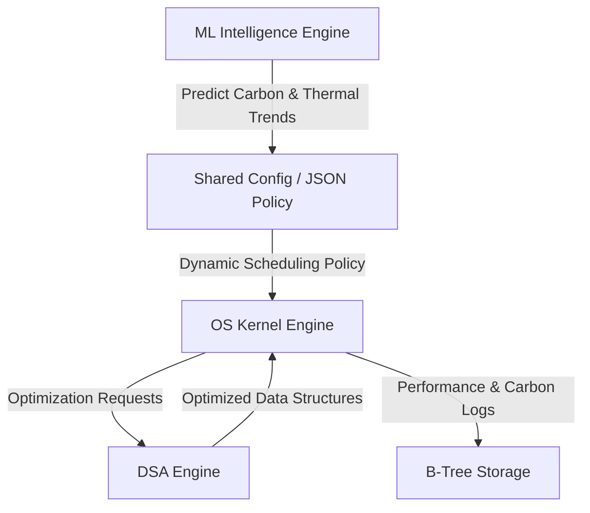

# Eco-Cloud: Carbon-Aware Data Center Scheduler  
### A Multi-Disciplinary Simulation of Green Cloud Computing


---

## Project Overview

**Eco-Cloud** is an advanced academic simulation of a data center operating system. Unlike traditional schedulers that optimize only for speed (Performance), Eco-Cloud optimizes for:

- Environmental Impact (Carbon Footprint)  
- Hardware Health (Thermal Efficiency)  

This project bridges three core domains:

1. Operating Systems  
2. Data Structures & Algorithms  
3. Artificial Intelligence  

The system integrates kernel-level scheduling, efficient algorithm design, and predictive machine learning to simulate next-generation sustainable cloud computing.

---

## System Architecture

The system operates as a **Discrete Event Simulation** with tightly integrated modules.



---

# Detailed Syllabus Mapping

---

## Part 1: Operating System Concepts (25+)

### Unit I: Introduction & System Structure

- **Batch Processing:** The simulation processes batches of jobs from CSV trace files.  
- **System Calls:** Simulates interaction between user jobs and the kernel (e.g., `sim_request_resource()`).  
- **Kernel Mode vs User Mode:** A privilege flag inside the Process Control Block.

---

### Unit II: Process Management

- **Process Control Block (PCB):** Contains PID, State, Registers, and Carbon Profile.  
- **7-State Model:** New, Ready, Running, Blocked, Terminated, Ready-Suspend, Blocked-Suspend.  
- **Context Switching:** Simulated tick overhead for saving and restoring registers.  
- **Multithreading:** Simulation uses threads to represent multiple CPU cores.  
- **Independent vs Cooperating Processes:** Jobs share a global energy budget.  
- **Producer–Consumer:** Job generator produces workloads; scheduler consumes them.  
- **Critical Section:** Carbon and thermal log updates.  
- **Mutex Locks:** Protect shared energy grid state.  
- **Semaphores:** Control ready queue capacity.

---

### Unit III: Process Scheduling

- **Long-Term Scheduler:** Admission control for jobs entering the system.  
- **Short-Term Scheduler:** CPU allocation decisions.  
- **Preemptive Scheduling:** Low-carbon and high-priority jobs can interrupt execution.

#### Scheduling Algorithms

- **FCFS**  
- **Round Robin (Time Quantum)**  
- **Priority Scheduling (Green-first)**  
- **Aging and Starvation Prevention**

#### Scheduling Metrics

- Throughput  
- Turnaround Time  
- Waiting Time  

---

### Unit IV: Deadlocks

- **Resource Modeling:** CPU cores, memory, and power.  
- **Safe State Detection:** Ensures grid stability.  
- **Banker’s Algorithm:** Prevents thermal and power overload.

---

### Unit V: Memory Management

- Variable partition allocation.  
- Best Fit vs First Fit strategies.  
- External fragmentation analysis.  
- Paging with frame allocation.

---

### Unit VI: I/O and Miscellaneous

- Thermal interrupt simulation.  
- SCAN disk scheduling for efficient logging.

---

## Part 2: Data Structures & Algorithms (Core Engine)

These are implemented manually without STL shortcuts.
### 1. Fibonacci Heap

**Role:** Dynamic ready queue.

**Why:** Supports efficient priority updates in O(1) amortized time.


### 2. Splay Tree

**Role:** Active job cache.

**Why:** Exploits locality of reference for fast repeated access.


### 3. Trie / Compressed Trie

**Role:** Efficient job ID storage.


### 4. B-Tree

**Role:** Disk indexing and log storage.

### 5. Huffman Coding

**Role:** Compression of simulation logs.

### 6. Bin Packing

**Role:** Energy-efficient server consolidation.


### 7. Graph Algorithms

**Role:** Network routing and energy-aware communication.

### 8. ARIMA Forecasting

**Role:** Carbon intensity prediction.


## Part 3: Machine Learning Intelligence

The ML module operates asynchronously.

### Features

- Carbon intensity forecasting  
- Workload classification  
- Logical policy generation  

The model generates scheduling policies such as:

```
IF Carbon > Threshold AND Job = Batch THEN Hibernate
```

---

# Repository Structure

```text
Eco-Cloud/
├── data/                  # Carbon datasets
├── docs/                  # Research and architecture
├── src/
│   ├── os_engine/
│   ├── ds_engine/
│   ├── ml_engine/
│   └── integration/
├── tests/
└── README.md
```

---

## Getting Started

### Prerequisites

- C++17 or higher  
- Python 3.8+  
- pandas, statsmodels, scikit-learn  

---

### Installation

Clone the repository:

```bash
git clone https://github.com/YourUsername/Eco-Cloud.git
cd Eco-Cloud
```

Run ML engine:

```bash
cd src/ml_engine
pip install -r requirements.txt
python generate_forecast.py
```

Compile simulation:

```bash
cd ../..
g++ -o eco_sim src/os_engine/*.cpp src/ds_engine/*.cpp
```

Run:

```bash
./eco_sim
```

---

## Contribution Workflow

We follow a strict feature-branch workflow.

1. Pick an issue  
2. Create a branch:

```bash
git checkout -b feature/your-task-name
```

3. Implement feature  
4. Open pull request  
5. Code review  
6. Merge  


---

# Research Goal

**Enhancing Carbon-Aware Data Center Scheduling Using Machine Learning-Assisted Predictive Models and Thermal Anomaly Detection**

---


Built for Academic Year 2025–2026  
Department of CSE (AIML)
